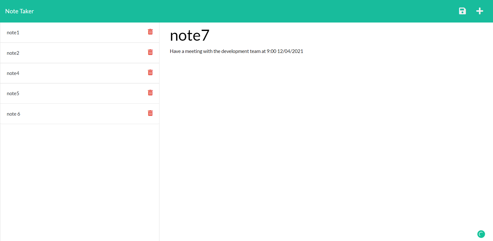
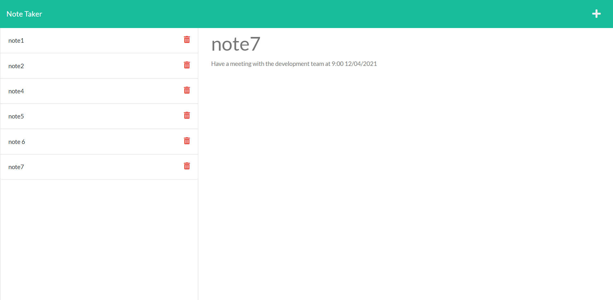
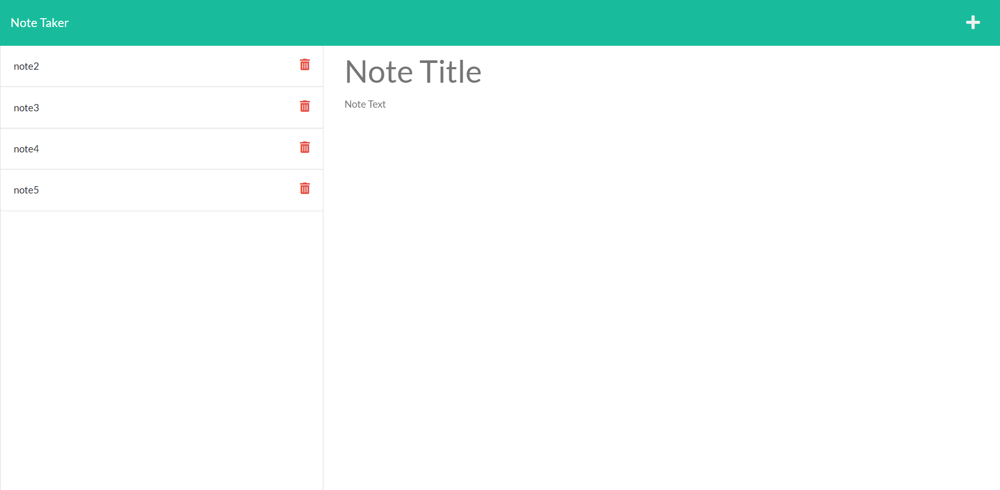

# Project Name :  Note Taker
  
  ## Description:
  Create an application that can be used to write and save note using an Express.js back end and saving also retrieve note data from a JSON file.
  ## Table of Contents 
  - [Installation](#installation)
  - [Usage](#usage)
  - [License](#license)
  - [Tests](#tests)
  - [ScreenShot](#screenShot)
  - [Links](#links)
  - [Questions](#questions)
  - [Copyright](#copyright)
  ## Installation
  to install dependencies , run this following command :
``` 
 npm i
 ```
  ## Usage
The User needs to clone first the repo then install dependencies and run the file server.js

  ## License
This Project is licensed under **ISC** license.
  ## Tests
  to run test , run this following command :
``` 
 no test required
 ```
 ## ScreenShot 

Home page :
   
Write/post a note :
  
Display the posted note :
  
Delete note 1:
  
  ## Links 
  The URL of the GitHub repository: https://github.com/MERYEM-AD/Note-Taker

  The URL of the functional, deployed application on Heroku: https://notetaker200.herokuapp.com/
  ## Questions
  iF you have any questions about the repo you can contact me by email : adiri.meryem.mw@gmail.com.

  Follow me on [my Github account](https://github.com/MERYEM-AD).
  ## Copyright

   
```
Copyright 2021 , Meryem Adiri.

Permission to use, copy, modify, and/or distribute this software for any purpose with or without fee is hereby granted, provided that the above copyright notice and this permission notice appear in all copies.

THE SOFTWARE IS PROVIDED "AS IS" AND THE AUTHOR DISCLAIMS ALL WARRANTIES WITH REGARD TO THIS SOFTWARE INCLUDING ALL IMPLIED WARRANTIES OF MERCHANTABILITY AND FITNESS. IN NO EVENT SHALL THE AUTHOR BE LIABLE FOR ANY SPECIAL, DIRECT, INDIRECT, OR CONSEQUENTIAL DAMAGES OR ANY DAMAGES WHATSOEVER RESULTING FROM LOSS OF USE, DATA OR PROFITS, WHETHER IN AN ACTION OF CONTRACT, NEGLIGENCE OR OTHER TORTIOUS ACTION, ARISING OUT OF OR IN CONNECTION WITH THE USE OR PERFORMANCE OF THIS SOFTWARE.

```